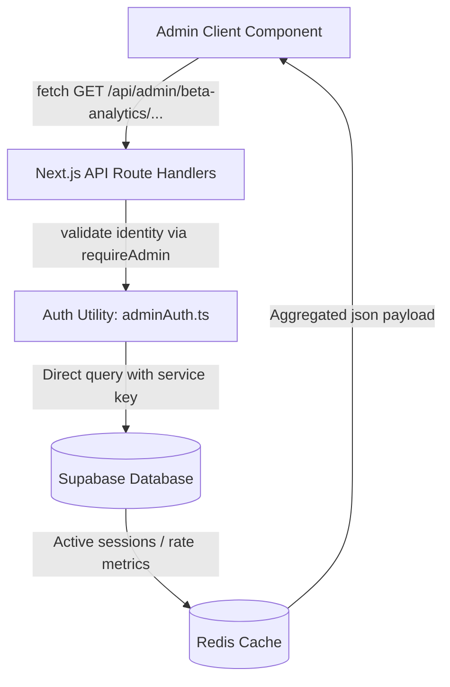

# KOVARI BETA ANALYTICS IMPLEMENTATION PLAN

This document outlines the complete architectural design and execution roadmap for integrating the **Beta Analytics Dashboard** into the Kovari admin application (`apps/admin`).

It synthesizes findings from:
- [beta_analytics_data_inventory.md](file:///c:/Users/Dell/Desktop/Coding/kovari/docs/analytics/beta_analytics_data_inventory.md) (schema details, queries, data paths)
- [beta_admin_component_audit.md](file:///c:/Users/Dell/Desktop/Coding/kovari/docs/analytics/beta_admin_component_audit.md) (existing dashboard layouts, filters, charts)
- [beta_activation_funnel.md](file:///c:/Users/Dell/Desktop/Coding/kovari/docs/analytics/beta_activation_funnel.md) (9-stage conversion funnel rules)
- [beta_retention_metrics.md](file:///c:/Users/Dell/Desktop/Coding/kovari/docs/analytics/beta_retention_metrics.md) (active user tracking definitions)

---

# 1. Route Architecture

## Proposed Route
The dashboard will live at:
`/beta-analytics` (corresponding to file path `apps/admin/app/beta-analytics/page.tsx`).

> [!NOTE]
> **Route Path Recommendation**:
> While the prompt proposes `/admin/beta-analytics`, the admin portal is hosted on its own subdomain (e.g., `admin.kovari.in`) where all sibling features are routed directly at the root (for example, `/users`, `/groups`, `/waitlist`, `/feedback`). Placing it at `/beta-analytics` maintains consistency with the flat hierarchy of the App Router and simplifies navigation structure.

## Route Hierarchy
The folder and file layout under `apps/admin` will be structured as follows:

```
apps/admin/app/
└── beta-analytics/
    ├── page.tsx                 # Dashboard Client entry page wrapping AdminLayoutWrapper
    ├── loading.tsx              # Fallback suspense loader spinner
    ├── error.tsx                # Error boundary handler (logs to Sentry)
    ├── components/
    │   ├── OverviewGrid.tsx     # KPI Metrics Cards container
    │   ├── FunnelCard.tsx       # Refactored conversion funnel widget
    │   ├── GrowthCharts.tsx     # Recharts area graph dashboard container
    │   ├── EngagementGrid.tsx   # DAU/WAU stats and retention visualizer
    │   └── DetailTables.tsx     # Custom lists for popular destinations and active users
    ├── hooks/
    │   └── useBetaAnalytics.ts  # Client fetch hook syncing states & polling
    └── types.ts                 # Type contracts for API response bodies
```

### Why it matches the current admin architecture:
1. **Separation of Concerns**: Dashboard logic is fully contained inside sub-components to prevent the main `page.tsx` file from swelling.
2. **Standard API Hooks**: Custom hooks are used to isolate state logic, query sync, and browser `fetch` loops (matching the implementation in [waitlist/page.tsx](file:///c:/Users/Dell/Desktop/Coding/kovari/apps/admin/app/waitlist/page.tsx)).
3. **App Router Layouts**: Inherits global layouts (authentication, loader screen, sidebar shell) by matching sibling page paradigms.

---

# 2. Page Architecture

The layout coordinates visual sections into a clean grid styled in sleek dark-mode, matching the [beta_dashboard_wireframe.md](file:///c:/Users/Dell/Desktop/Coding/kovari/docs/analytics/beta_dashboard_wireframe.md) specs.

## Section 1: Overview Section (KPI Cards)
Renders single-value statistics using [MetricCard.tsx](file:///c:/Users/Dell/Desktop/Coding/kovari/apps/admin/components/admin/MetricCard.tsx):
- **Total Users**: Count of registered beta users (excluding admins).
- **Profiles Completed**: Count of users who finished onboarding form.
- **Travel Intentions**: Count/ratio of users who added at least one destination intention.
- **Match Interests**: Count of unilateral signals sent.
- **Messages Sent**: Count of messages exchanged (excluding developer 'init' actions).
- **Notifications Sent**: Total notification stack volume and push success rate.
- **Feedback Submitted**: Total feedback bug/feature logs contributed by users.
- **Waitlist Conversions**: Waitlist invitations sent vs. active user registrations.

## Section 2: Funnel Section
A single card displaying the **9-Stage Conversion Funnel**:
1. **Invited**: Email addresses marked `beta_invited` or `beta_active` in waitlist.
2. **Activated**: Registered users mapped with status = `activated`.
3. **Onboarded**: Users with `onboarding_completed` = `true`.
4. **Travel Intent**: Users with at least one active JSONB intention block.
5. **Explore Viewed**: Visited feed page (flagged as "Requires Client Telemetry").
6. **Interest Sent**: Sent at least one match interest request.
7. **Interest Accepted**: Mutual interest signals accepted.
8. **Conversation**: Initiated direct chat session with another stranger.
9. **Message Sent**: Exchanged at least one direct text message.

## Section 3: Growth Section
Side-by-side [GrowthChart.tsx](file:///c:/Users/Dell/Desktop/Coding/kovari/apps/admin/components/admin/GrowthChart.tsx) grids:
- **User Growth**: Daily signup volume curves over 30 days.
- **Profile Growth**: Onboarding completion timeline.
- **Messaging Activity**: Exchanged direct message timeline.
- **Travel Intentions Growth**: Volume of intentions created per day.

## Section 4: Engagement Section
A dynamic dashboard containing active metrics and system logs:
- **DAU / WAU / MAU metrics** (once backend `last_seen_at` telemetry is patched).
- **Active Conversations (7d)**: Active chat sessions.
- **Push Notification Health Widget**: FCM status audits (`delivered`, `no_token`, `failed`).

## Section 5: Tables Section
iOS-style list grids mapping categorical splits:
- **Top Destinations**: Unnested jsonb popularity listings.
- **Most Active Users**: Top message-sending user ranking.
- **Recent Feedback**: Last 5 feedback notes submitted (with navigation hooks to resolve details).
- **Recent Signups**: Latest activated cohort registrations.

---

# 3. Data Flow Architecture

## Request Flow
The analytics dashboard requests flow through standard local boundaries:



## Metrics Mapping & Cache Policies

| Metric | Source Table | Query Path | Transformation Layer | Cache Layer |
| :--- | :--- | :--- | :--- | :--- |
| **Total Users** | `public.users` | `users` left join `profiles` & anti-join `admins` | Grouping count of distinct UUIDs | Redis `cache:analytics:overview`, TTL: 1 hr |
| **Profiles Completed** | `public.users` | Filter `onboarding_completed = true` | Count of records | Redis `cache:analytics:overview`, TTL: 1 hr |
| **Travel Intentions** | `public.profiles` | Unnest `travel_intentions` JSONB array | Distinct unnested destination count | Redis `cache:analytics:travel`, TTL: 2 hr |
| **Match Interests** | `public.match_interests` | Group by status | Count breakdown | Redis `cache:analytics:interests`, TTL: 30 min |
| **Messages Sent** | `public.direct_messages` | Count `media_type != 'init'` | Distinct count filtering admin IDs | Redis `cache:analytics:messages`, TTL: 30 min |
| **Notifications Sent** | `public.notifications` | Group by `push_status` | Status count distributions | Redis `cache:analytics:notifications`, TTL: 30 min |
| **Feedback** | `public.feedback` | Count unique contributors | Distinct count of `user_id` | Redis `cache:analytics:feedback`, TTL: 1 hr |
| **Waitlist Conversions**| `public.waitlist` | Filter status lists | Ratio calculation | Redis `cache:analytics:waitlist`, TTL: 1 hr |

---

# 4. Data Fetching Strategy

## Existing Pattern
Audit of `apps/admin` shows two patterns:
1. **Server Components (Static/Initial)**: Direct query reads in server files (e.g., [page.tsx](file:///c:/Users/Dell/Desktop/Coding/kovari/apps/admin/app/page.tsx#L51-L108)).
2. **Client Components (Dynamic/Interactive)**: Fetching API data in `useEffect` and updating local states (used in [waitlist/page.tsx](file:///c:/Users/Dell/Desktop/Coding/kovari/apps/admin/app/waitlist/page.tsx)).
3. **Libraries**: No third-party data-fetching libraries (like SWR or React Query) are currently configured. Standard browser `fetch` is used.

## Recommended Strategy
We recommend building **Client Components** fetching data from Next.js Route Handlers (`/api/admin/beta-analytics/*`).

### Rationale:
- Matches the waitlist analytics architecture, ensuring consistency.
- Enables interactive, real-time filters (switching cohorts, dates, and manually clicking "Refresh" with spinners) without rebuilding server payloads.
- Avoids bloat in main layout trees.

### Pros:
- High responsiveness for filters (no full-page server refreshes).
- Standardized error/loading UI.
- Direct alignment with the app's existing state syncing mechanism.

### Cons:
- Multiple round-trips if split into multiple APIs. This is resolved by bundling metrics into a few cohesive handlers.

---

# 5. Server Actions

Audit of the admin application confirms there are **zero Server Actions** (no `"use server"` files exist). To keep standard conventions, we recommend using standard Next.js **Route Handlers (APIs)**. 

However, if Server Actions were to be introduced, or to represent the backend queries modularly, we define the following service actions:

### 1. `getBetaAnalyticsOverview()`
- **Inputs**: `{ batchId?: string, startDate?: string, endDate?: string }`
- **Outputs**: `{ totalUsers: number, onboardingRate: number, intentRate: number, feedbackCount: number }`
- **Data Source**: `public.users`, `public.profiles`, `public.feedback`
- **Complexity**: Medium (requires joins to filter out admins).

### 2. `getGrowthMetrics()`
- **Inputs**: `{ startDate: string, endDate: string }`
- **Outputs**: `{ dailyGrowth: { date: string, signups: number, activations: number }[] }`
- **Data Source**: `public.waitlist`, `public.users`
- **Complexity**: Medium (date alignment filling).

### 3. `getFunnelMetrics()`
- **Inputs**: `{ batchId?: string }`
- **Outputs**: `{ steps: { label: string, value: number, pct: number }[] }`
- **Data Source**: `public.waitlist`, `public.users`, `public.profiles`, `public.match_interests`, `public.conversations`, `public.direct_messages`
- **Complexity**: Large (requires 9 separate database count calculations with anti-joins).

### 4. `getEngagementMetrics()`
- **Inputs**: `{ startDate: string, endDate: string }`
- **Outputs**: `{ dau: number, wau: number, activeChats: number, pushHealth: { status: string, count: number }[] }`
- **Data Source**: `public.users`, `public.direct_messages`, `public.notifications`
- **Complexity**: Medium.

### 5. `getTopDestinations()`
- **Inputs**: `{ limit: number }`
- **Outputs**: `{ destination: string, count: number, percentage: number }[]`
- **Data Source**: `public.profiles` (`travel_intentions` JSONB)
- **Complexity**: Medium (requires database JSONB array unnesting).

---

# 6. API Requirements

## Existing APIs Reusable
- **`/api/admin/metrics`**: Can be polled for real-time Redis active session numbers, reducing DB query load for simple overview counts.
- **`/api/admin/feedback`**: Reused directly for redirecting admins to detail views upon clicking recent feedback rows.

## New APIs Required

### 1. `GET /api/admin/beta-analytics/overview`
- **Purpose**: Feeds KPI overview dashboard cells.
- **Response Shape**:
```json
{
  "totalUsers": 15,
  "activatedUsers": 14,
  "onboardedUsers": 10,
  "travelIntentCount": 10,
  "matchInterestsSent": 5,
  "messagesSent": 12,
  "notificationsSent": 45,
  "notificationReadRate": 42.2,
  "feedbackSubmitted": 4,
  "waitlistConversionPct": 93.3
}
```
- **Data Source**: `public.users`, `public.profiles`, `public.feedback`, `public.match_interests`, `public.direct_messages`, `public.notifications`.

### 2. `GET /api/admin/beta-analytics/growth`
- **Purpose**: Renders the 30-day Area Growth Charts.
- **Response Shape**:
```json
{
  "dailyGrowth": [
    { "date": "2026-06-20", "users": 15, "profiles": 10, "messages": 2 },
    { "date": "2026-06-21", "users": 16, "profiles": 11, "messages": 5 }
  ]
}
```
- **Data Source**: `public.users` (created_at), `public.profiles` (created_at), `public.direct_messages` (created_at).

### 3. `GET /api/admin/beta-analytics/funnel`
- **Purpose**: Populates the 9-stage conversion funnel.
- **Response Shape**:
```json
{
  "funnel": [
    { "stage": "invited", "count": 15, "pct": 100 },
    { "stage": "activated", "count": 14, "pct": 93.3 },
    { "stage": "onboarded", "count": 10, "pct": 66.7 },
    { "stage": "intent_added", "count": 10, "pct": 66.7 },
    { "stage": "explore_viewed", "count": null, "pct": null, "warning": "Requires client telemetry integration" },
    { "stage": "interest_sent", "count": 5, "pct": 33.3 },
    { "stage": "interest_accepted", "count": 0, "pct": 0.0 },
    { "stage": "conversation", "count": 0, "pct": 0.0 },
    { "stage": "message_sent", "count": 0, "pct": 0.0 }
  ]
}
```
- **Data Source**: SQL queries defined in [beta_analytics_queries.sql](file:///c:/Users/Dell/Desktop/Coding/kovari/docs/analytics/beta_analytics_queries.sql).

### 4. `GET /api/admin/beta-analytics/engagement`
- **Purpose**: Observes retention curves, DAU, and notification push failures.
- **Response Shape**:
```json
{
  "dau": 2,
  "wau": 12,
  "activeChats": 5,
  "pushHealth": {
    "delivered": 12,
    "no_token": 25,
    "failed": 3,
    "suppressed": 5
  }
}
```
- **Data Source**: `public.users` (`last_seen_at`), `public.notifications` (`push_status`).

### 5. `GET /api/admin/beta-analytics/tables`
- **Purpose**: Generates categorical tables.
- **Response Shape**:
```json
{
  "destinations": [
    { "name": "Goa", "count": 12, "pct": 80.0 },
    { "name": "Manali", "count": 4, "pct": 26.7 }
  ],
  "activeUsers": [
    { "id": "uuid-1", "name": "Alice", "sent": 45, "received": 30 },
    { "id": "uuid-2", "name": "Bob", "sent": 20, "received": 25 }
  ],
  "recentFeedback": [
    { "id": "feedback-1", "name": "Alice", "type": "bug", "message": "Explore crashes" }
  ]
}
```
- **Data Source**: `public.profiles` (`travel_intentions`), `public.direct_messages`, `public.feedback`.

---

# 7. Backend Requirements

## Existing Queries
Yes. The SQL queries written inside [beta_analytics_queries.sql](file:///c:/Users/Dell/Desktop/Coding/kovari/docs/analytics/beta_analytics_queries.sql) are clean and complete. They filter out founder test accounts (`public.admins`) using anti-joins, making them fully production-ready.

## New Queries Required

### 1. User Growth Timeline (Daily counts filling gaps)
```sql
SELECT 
  d.day::date AS date,
  COUNT(u.id) AS count
FROM GENERATE_SERIES(NOW() - INTERVAL '30 days', NOW(), '1 day') d(day)
LEFT JOIN public.users u ON (u.activation_date AT TIME ZONE 'Asia/Kolkata')::date = d.day::date
  AND u.beta_status = 'activated'
  AND u.id NOT IN (
    SELECT DISTINCT usr.id FROM public.users usr 
    JOIN public.profiles prf ON usr.id = prf.user_id 
    JOIN public.admins adm ON LOWER(prf.email) = LOWER(adm.email)
  )
GROUP BY d.day
ORDER BY d.day ASC;
```
- **Query Complexity**: Medium
- **Performance Risk**: Low
- **Caching**: Redis TTL 1 hour

### 2. Destination Popularity (JSONB Unnesting)
```sql
WITH intentions AS (
  SELECT JSONB_ARRAY_ELEMENTS(travel_intentions)->>'destination_name' AS destination
  FROM public.profiles p
  JOIN public.users u ON p.user_id = u.id
  WHERE u.beta_status = 'activated'
    AND u.id NOT IN (
      SELECT DISTINCT usr.id FROM public.users usr 
      JOIN public.profiles prf ON usr.id = prf.user_id 
      JOIN public.admins adm ON LOWER(prf.email) = LOWER(adm.email)
    )
)
SELECT 
  destination,
  COUNT(*) AS count,
  ROUND(COUNT(*) * 100.0 / (SELECT COUNT(*) FROM intentions), 2) AS percentage
FROM intentions
GROUP BY destination
ORDER BY count DESC
LIMIT 10;
```
- **Query Complexity**: Large (requires dynamic JSONB extraction and CTE aggregates)
- **Performance Risk**: Medium (table scan on profiles)
- **Index Recommendation**: Functional GIN index on `travel_intentions` columns.
- **Caching**: Redis TTL 2 hours

### 3. Active Users Message ranking
```sql
SELECT 
  p.name,
  u.email,
  COUNT(m.id) AS messages_sent
FROM public.users u
JOIN public.profiles p ON u.id = p.user_id
JOIN public.direct_messages m ON u.id = m.sender_id
WHERE m.media_type IS DISTINCT FROM 'init'
  AND u.id NOT IN (
    SELECT DISTINCT usr.id FROM public.users usr 
    JOIN public.profiles prf ON usr.id = prf.user_id 
    JOIN public.admins adm ON LOWER(prf.email) = LOWER(adm.email)
  )
GROUP BY p.name, u.email
ORDER BY messages_sent DESC
LIMIT 10;
```
- **Query Complexity**: Medium
- **Performance Risk**: Medium (large messages tables)
- **Caching**: Redis TTL 30 minutes

## Caching Recommendations
All analytical queries must bypass direct database tables on fast polling loops by writing payloads to Redis:
- **Base Key**: `cache:beta_analytics:*`
- **Cache Invalidation**: Delete keys when new invitations are dispatched via `send-beta-invites` route or when a batch status update occurs.

---

# 8. Frontend Requirements

## KPI Cards
- **Metric Cards Grid**: List rows grouped under `GroupContainer.tsx` and custom standalone `MetricCard.tsx`.
- **Reusable?**: **Yes (100%)**. [MetricCard.tsx](file:///c:/Users/Dell/Desktop/Coding/kovari/apps/admin/components/admin/MetricCard.tsx) and iOS layout helpers (`GroupContainer`, `ListRow`) fit this design pattern immediately.

## Charts
- **Area chart**: Tracking daily signups and intentions growth.
- **Bar chart**: Category distributions.
- **Reusable?**: **Yes (95%)**. [GrowthChart.tsx](file:///c:/Users/Dell/Desktop/Coding/kovari/apps/admin/components/admin/GrowthChart.tsx) and [SourceBreakdown.tsx](file:///c:/Users/Dell/Desktop/Coding/kovari/apps/admin/components/admin/SourceBreakdown.tsx) are fully wrapper-configured using Recharts.

## Funnel Visualizations
- **Horizontal Progress Funnel**:
- **Reusable?**: **Partial (70%)**. The existing [Funnel.tsx](file:///c:/Users/Dell/Desktop/Coding/kovari/apps/admin/components/admin/Funnel.tsx) component uses hardcoded steps (`views`, `clicks`, `signups`). It needs to be refactored to support dynamic step inputs.

### Modified Funnel Props interface:
```typescript
interface FunnelStep {
  label: string;
  value: number | null;
  pct: number | null;
  icon?: LucideIcon;
  warning?: string;
}
interface FunnelProps {
  steps: FunnelStep[];
}
```

## Tables
- **Categorical Tables**: Shadcn elements inside [table.tsx](file:///c:/Users/Dell/Desktop/Coding/kovari/apps/admin/components/ui/table.tsx) are present and will be imported directly to construct clean grids.

## Filters
- **Date Range Picker**: 🔴 **Missing**. Currently waitlist analytics use hardcoded 30-day boundaries. A Calendar Date Picker (`ui/calendar.tsx` and `ui/popover.tsx`) must be introduced.
- **Beta Batch Selector**: Can reuse Radix `Select` structures to toggle target cohorts (`all`, `batch_1`, `batch_2`).

---

# 9. Reuse Analysis

### Reusable Immediately

| Component | Path | Confidence |
| :--- | :--- | :--- |
| `MetricCard` | [MetricCard.tsx](file:///c:/Users/Dell/Desktop/Coding/kovari/apps/admin/components/admin/MetricCard.tsx) | **100%** |
| `GrowthChart` | [GrowthChart.tsx](file:///c:/Users/Dell/Desktop/Coding/kovari/apps/admin/components/admin/GrowthChart.tsx) | **95%** |
| `SourceBreakdown`| [SourceBreakdown.tsx](file:///c:/Users/Dell/Desktop/Coding/kovari/apps/admin/components/admin/SourceBreakdown.tsx) | **95%** |
| `AdminLayoutWrapper`| [AdminLayoutWrapper.tsx](file:///c:/Users/Dell/Desktop/Coding/kovari/apps/admin/components/AdminLayoutWrapper.tsx) | **100%** |
| `iOS Layouts` | [GroupContainer.tsx](file:///c:/Users/Dell/Desktop/Coding/kovari/apps/admin/components/ui/ios/GroupContainer.tsx) | **100%** |

### Requires Minor Modification

| Component | Path | Required Change |
| :--- | :--- | :--- |
| `Funnel` | [Funnel.tsx](file:///c:/Users/Dell/Desktop/Coding/kovari/apps/admin/components/admin/Funnel.tsx) | Generalize to take dynamic steps array prop rather than hardcoded objects |
| `AdminSidebar` | [AdminSidebar.tsx](file:///c:/Users/Dell/Desktop/Coding/kovari/apps/admin/components/AdminSidebar.tsx) | Add dynamic item linking `/beta-analytics` |

### Must Be Created

| Component | Reason |
| :--- | :--- |
| `DateRangePicker` | Allows filtering database records by flexible timeframes (missing in project) |
| `BetaAnalyticsFilters` | Wraps Date Range and Batch Select selectors |
| `OverviewGrid` | Handles dashboard KPI cards formatting |
| `API Router` | Path `/api/admin/beta-analytics` aggregating stats with security authorization boundaries |
| `page.tsx` | Main page view at `apps/admin/app/beta-analytics/page.tsx` coordinate modules |

---

# 10. Implementation Breakdown

### Task 1: Fix Active Users Telemetry Gap (Small)
- **Description**: Add background updates to `users.last_seen_at` on authenticated requests in `apps/web/src/middleware.ts` (throttling database writes using Redis).
- **Dependencies**: None.
- **Effort**: 2 hours.

### Task 2: Create `analytics_events` Database Migration (Small)
- **Description**: Add schema migration file `supabase/migrations/20260624000000_create_analytics_events.sql` to define raw clickstream table schemas ensuring database reproducibility.
- **Dependencies**: None.
- **Effort**: 1 hour.

### Task 3: Refactor Funnel Component (Small)
- **Description**: Refactor `Funnel.tsx` to take a dynamic array of stages.
- **Dependencies**: None.
- **Effort**: 2 hours.

### Task 4: Implement Date Range Picker (Medium)
- **Description**: Add Shadcn calendar-picker elements to the admin ui and configure filter bounds.
- **Dependencies**: `lucide-react`, `date-fns`.
- **Effort**: 4 hours.

### Task 5: Build API Aggregation Routes (Medium)
- **Description**: Create the Next.js GET route handler `/api/admin/beta-analytics` executing PostgreSQL joins, applying Redis cache wrappers, and returning structured JSON payloads.
- **Dependencies**: `supabaseAdmin`, `requireAdmin`.
- **Effort**: 6 hours.

### Task 6: Build Front-end Layout Page (Large)
- **Description**: Orchestrate dashboard grids, charts, tables, filters, and loading animations inside `apps/admin/app/beta-analytics/page.tsx`.
- **Dependencies**: Task 4, Task 5.
- **Effort**: 1.5 days.

---

# 11. Implementation Roadmap

```
+-------------------------------------------------------------------------------+
| PHASE 1: Data Infrastructure Layer (Tasks 1, 2)                              |
| - Patch last_seen_at telemetry in web middleware                              |
| - Create analytics_events migration schema                                    |
+-------------------------------------------------------------------------------+
                                  │
                                  ▼
+-------------------------------------------------------------------------------+
| PHASE 2: API & Aggregation Layer (Task 5)                                     |
| - Write SQL aggregations for overview, funnel, and engagement metrics        |
| - Wrap Route Handler endpoints with Redis cache policies                      |
+-------------------------------------------------------------------------------+
                                  │
                                  ▼
+-------------------------------------------------------------------------------+
| PHASE 3: Custom Component Extensions (Tasks 3, 4)                             |
| - Refactor Funnel component to accept dynamic steps array                     |
| - Implement standard Date Range Picker                                        |
+-------------------------------------------------------------------------------+
                                  │
                                  ▼
+-------------------------------------------------------------------------------+
| PHASE 4: UI Composition & Front-end Integration (Task 6)                     |
| - Write apps/admin/app/beta-analytics/page.tsx dashboard page                 |
| - Bind Recharts Area and Bar configurations                                   |
| - Add navigation menu links in AdminSidebar                                   |
+-------------------------------------------------------------------------------+
                                  │
                                  ▼
+-------------------------------------------------------------------------------+
| PHASE 5: Optimization & Validation                                            |
| - Validate SQL execution planners using EXPLAIN ANALYZE                       |
| - Test Redis cache invalidation hooks                                         |
+-------------------------------------------------------------------------------+
```

---

# 12. Final Recommendation

### Should Beta Analytics live at `/admin/beta-analytics`?
**No.** We strongly recommend implementing the route at `/beta-analytics` (file path `apps/admin/app/beta-analytics/page.tsx`). 

This keeps the path structure consistent with all other pages in the admin control center (such as `/users`, `/waitlist`, and `/feedback`) which live directly under the App Router root. Nesting a single feature under `/admin` would deviate from the existing layout conventions and introduce unnecessary subfolders.

### Can Beta Analytics be built mostly from existing infrastructure?
**Yes.**

- **Estimated Code Reuse Percentage**: **~85%**
- **Confidence Level**: **High (95%)**

### Key Risks Identified:
1. **Telemetry Write Storms**: Updating `last_seen_at` on every user interaction could overwhelm the database during high-traffic beta phases.
   - *Mitigation*: Throttle updates in middleware by writing to a fast Redis set, persisting back to PostgreSQL periodically or only once per calendar day per user.
2. **Missing telemetry writes**: The "Explore Viewed" step in the activation funnel currently has no telemetry instrumentation.
   - *Mitigation*: Add client-side logging when the Explore page loads to submit the `explore_viewed` tracking signal via `/api/analytics/track`.
